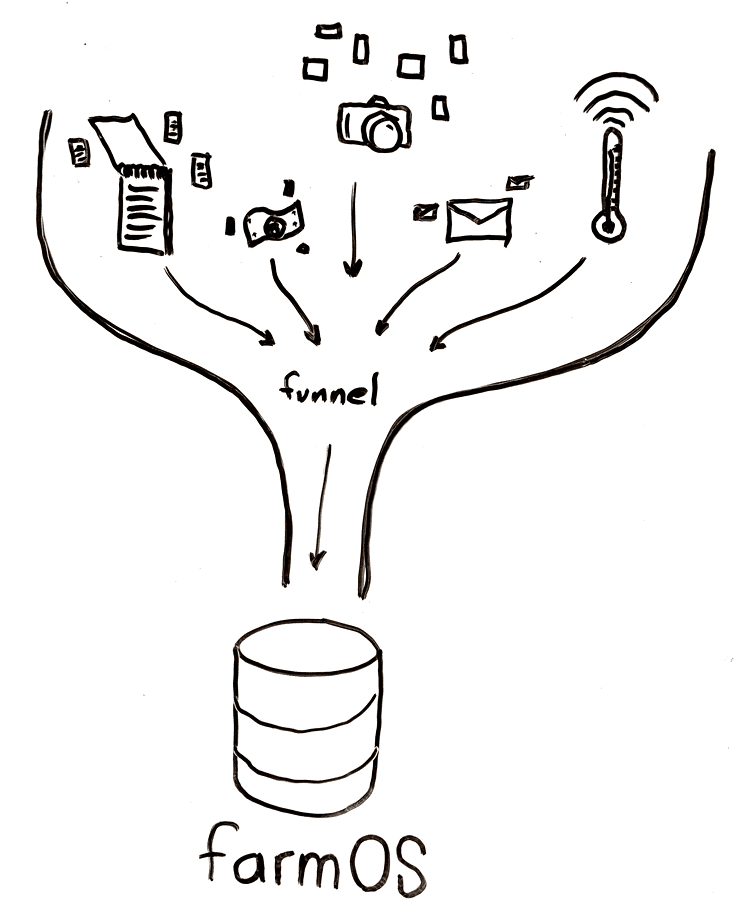

# farmOS 1.0

## A long journey for a small number

After more than 5 years of development, I'm pleased to announce that
**[farmOS 1.0 has been released]**!

What does that mean? In some ways, not much. farmOS is stable, and continues to
improve and grow with every iteration. It is already used by hundreds of farms
all over the world, and is being deployed in agricultural research projects to
help understand how production practices affect soil health, nutrient density,
carbon sequestration, and other indicators.

What *is* significant about this release is that we've made some big
improvements to the [farmOS API], which allows other software systems to
communicate with farmOS and push/pull data. This means other ag software
developers can build more specialized features using the tools of their choice,
while still leveraging the farmOS server as a central database. This is a huge
step towards interoperability between different tools - and it keeps the data
ownership in the hands of the farmer.

With this release, I thought it would be fun to take a look back at where things
started, and what we've accomplished along the way.

## Initial commits

The first official commits happened in early 2014, with the creation of the
[farm distribution], along with the [log] and [farm_log] modules (but to be
fair, the ideas [go back even farther] than that). I shared it with Dorn Cox and
RJ Steinert at [Farm Hack], who became the first early adopters and
collaborators. Shortly after, I presented on the topics of open source software
and hardware at the [2014 CT NOFA Winter Conference], and shared my vision for
what we were starting to build. In September 2014, we
[officially adopted the name] "farmOS", and that winter marked the first commits
to the [livestock] and [equipment] modules, followed by the [sensor] module a
few months later.

## Leaps and bounds

The project and community has developed rapidly since then! There have been over
3000 [commits] to the [farmOS repository], 2 alpha releases, 18 beta releases, 2
release candidates, and over 38,000 downloads from the
[drupal.org project page]. We've discussed countless ideas in the form of
[feature requests], [bug reports], and [conversations] in the [chat room] and
[monthly calls], as well as at in-person hackathons and conferences like
[GOAT: Gathering for Open Agriculture Technology]. All of this collaboration has
accelerated farmOS's development, and turned it into a mature platform.

But that's not all! A number of related projects have been developed to
complement and extend farmOS, including add-on modules for [holistic grazing],
[nutrient management], [produce safety], [beekeeping], [mushroom] and [maple]
production, [weather], and [forest management].

Jamie Gaehring and Alex Smith are currently working on a [farmOS Client] app, a
single-page JavaScript application that works offline and provides a simplified
UI for creating observations and other logs in the field (which can be synced
back to farmOS when internet is available). This offline app is the basis for
the Android and iOS native apps that will soon be available in app stores! It
will also be available at [https://farmOS.app], and eventually we hope to pull
it into farmOS core as an offline "field mode", or even as the basis for a
streamlined and simplified default UI.

We are also developing reusable libraries that other systems can use to
communicate with farmOS over HTTP requests, in [JavaScript] and [Python], along
with a [farmOS Aggregator] tool for pushing/pulling data from sets of different
farmOS systems in bulk. These tools open the doors to a new world of
possibilities, leveraging the distributed and farmer-owned nature of farmOS,
and enabling standardized communication and interoperability of data between
different systems.

## Thanks to YOU!

Much of this development has been generously supported through partnerships and
collaborations with organizations including [Wolfe's Neck Farm], [Farm Hack],
the [Cornell Soil Health Lab], [UVM Extension], the [Globetrotter Foundation]
and [Paicines Ranch], [NRCS], [VVBGA], [PASA], [USFS], [NFA], [BFA], and
[Our Sci], and more. And that isn't even counting all the individual farmers who
are using it! We wouldn't be here without the contributions and support of
everyone in the [farmOS community].

**Thank you!**

We've got big plans ahead - and a long way to go from here! The last five years
have put us on a solid foundation, and I believe the next five will produce even
greater things. If you are interested in supporting these efforts, there are
lots of ways you can [contribute].

Thanks again to everyone who made this possible.

-Michael Stenta

[farmOS 1.0 has been released]: https://www.drupal.org/project/farm/releases/7.x-1.0
[farmOS API]: https://farmos.org/development/api
[farm distribution]: https://github.com/farmOS/farmOS/commit/1219fc52041a067796e2d01150cd5419962c7844
[log]: https://github.com/mstenta/log/commit/ac3b0eebcd65515fe97833055d215c89d0450c0a
[farm_log]: https://github.com/farmOS/farmOS/commit/10822e262d552a84d9c5e67bc69e7ce5b8ac244c
[go back even farther]: https://github.com/farmOS/farmOS/commit/53ca3e8753d7eca390338c5563de454c1e3e5a66
[Farm Hack]: http://farmhack.org
[2014 CT NOFA Winter Conference]: https://www.youtube.com/watch?v=raLwz0Y9YV4
[officially adopted the name]: https://github.com/farmOS/farmOS/commit/60294e8c5108528e228d5cb922cc271c6a4f3a5e
[livestock]: https://github.com/farmOS/farmOS/commit/cf9824be5c5a582a21e76c8d5ecaacc23c7eda06
[equipment]: https://github.com/farmOS/farmOS/commit/67539de3dc986b54ae8e88def4703f5f501bf68b
[sensor]: https://github.com/farmOS/farmOS/commit/1678ded540e5fb960129d151af4f6f94bbe651a8
[commits]: https://github.com/farmOS/farmOS/commits
[farmOS repository]: https://github.com/farmOS/farmOS
[drupal.org project page]: https://drupal.org/project/farm
[feature requests]: https://www.drupal.org/project/issues/farm?status=All&categories=3
[bug reports]: https://www.drupal.org/project/issues/farm?status=All&categories=1
[conversations]: http://irc.farmos.org
[chat room]: https://riot.im/app/#/room/#farmOS:matrix.org
[monthly calls]: https://farmos.org/community/monthly-call
[GOAT: Gathering for Open Agriculture Technology]: http://goatech.org
[holistic grazing]: https://github.com/farmOS/farm_grazing
[nutrient management]: https://github.com/farmOS/farm_nutrient
[produce safety]: https://github.com/farmOS/farm_produce_safety
[beekeeping]: https://github.com/farmOS/farm_bee
[mushroom]: https://github.com/farmOS/farm_mushroom
[maple]: https://github.com/farmOS/farm_maple
[weather]: https://github.com/farmOS/farm_weather
[forest management]: https://github.com/farmOS/farm_forest
[farmOS Client]: https://github.com/farmOS/farmOS-client
[https://farmOS.app]: https://farmOS.app
[JavaScript]: https://github.com/farmOS/farmOS.js
[Python]: https://github.com/farmOS/farmOS.py
[farmOS Aggregator]: https://github.com/farmOS/farmOS-aggregator
[Wolfe's Neck Farm]: https://www.wolfesneck.org
[Farm Hack]: http://farmhack.org
[Cornell Soil Health Lab]: https://soilhealth.cals.cornell.edu
[UVM Extension]: https://www.uvm.edu/extension
[Globetrotter Foundation]: https://globetrotterfoundation.org
[Paicines Ranch]: https://paicinesranch.com
[NRCS]: https://www.nrcs.usda.gov
[VVBGA]: http://www.uvm.edu/vtvegandberry
[PASA]: https://pasafarming.org
[USFS]: https://www.fs.fed.us
[NFA]: https://www.nfa.org.ug
[Our Sci]: http://our-sci.net
[BFA]: http://bionutrient.org
[Foundation for Food and Agriculture Research]: https://foundationfar.org
[farmOS community]: https://farmOS.org/community/supporters
[contribute]: https://farmOS.org/community/contribute
