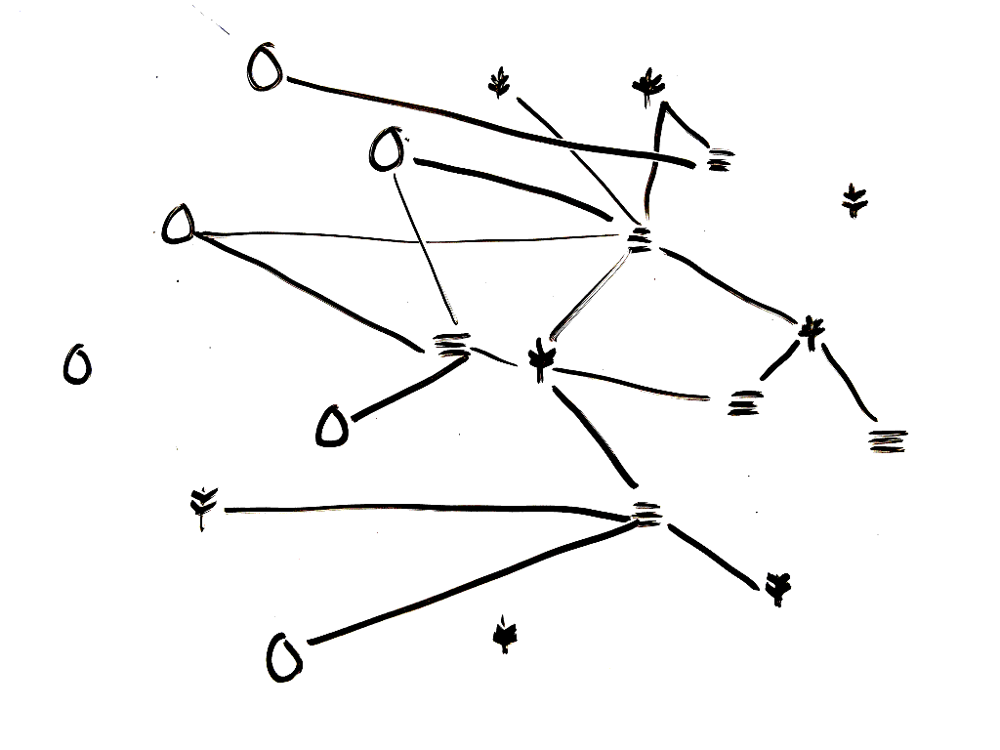

# Funding farmOS

## How to sustain free software

When I talk to people about [farmOS], or open source software development in
general, I am often asked: "how do you support yourself?" It's a valid question.
**[farmOS is free]** (as in both [beer and speech]). So how do you make money
giving something away?

## The case for [Free and Open Source Software]

If a farmer gave away their harvests for free, they would be unable to pay their
expenses, their workers, and themselves. Farming takes *limited* resources
(soil, inputs, labor) and transforms them into a *limited* product (food).
**Software is different**. It still requires limited resources to create (the
hours and attention of a programmer), but once the code is written it can be
copied for free.

Proprietary software licenses put restrictions on this ability to copy, in order
to turn an *unlimited* product into a *limited* one, so that it can be sold at
a premium. A [free software] license, on the other hand, explicitly allows users
to copy, modify, and redistribute the software without restriction.

This allows users to extend, modify, and build on top of the code that was
written by others. Instead of being restricted and controlled by a single
company or individual, communities of users and developers can grow around the
project to build and support it. Furthermore, the development process is
cumulative, building on the work that came before
(["standing on the shoulders of giants"]).

This gives the power back to the users, and everyone benefits from the shared
effort. For these reasons, open source software has become the backbone of
modern computing, and many people use it every day without even realizing it.

## Sustainability

It's important to recognize that software *does* take work, both to create it
and to maintain it. And *that* is what requires funding. In order for a project
to sustain itself into the future, it needs to support the core developers that
build and maintain it. It also needs to maintain the community infrastructure
that enables and encourages collaboration.

Without the ability to "sell" the software, open source developers have come
up with other ways of supporting their efforts. [Nadia Eghbal] has compiled an
[exhaustive list] of all the ways that people get paid for open source work,
with pros and cons of each. It is a major challenge, and what works for one
project may not work for others. Nevertheless, many open source communities and
companies are making it work, and more users are seeing the value in supporting
the projects they use.

#### farmOS and Farmier

When I started farmOS, I wanted to make sure that the *project* remained
independent of any *company*. So I created [farmOS] as the open source project,
and [Farmier] for providing services like [hosting], support, and sponsored
feature development. Farmier is not backed by [venture capital]. It is supported
by the farmers and organizations that use farmOS, and I plan to keep it that
way. I value privacy and data ownership myself, and I want that to be a priority
for Farmier, as well.

## Sponsored development

The primary means of supporting my time on farmOS thusfar has been through
sponsored development projects. I work directly with farmers, universities, and
other organizations to build features that address a specific need. We approach
this as a standard development contract: we make a plan, estimate the time it
will take, and then build it. When it's done, it can be released to the farmOS
community, and sponsorship credit is given to the funders on [farmOS.org].

This model is used successfully in other open source communities, as well. For
example, in the [Drupal] community, developers use open source modules to build
websites for their clients, and often add features or fix bugs in the process.
These changes are then contributed back "upstream" to the module itself, so that
they can be used again in future projects. A great example of this is
[Jacob Rockowitz]'s work on the [Webform] module, which he describes in his blog
post, "[Sponsor a Feature]".

## Crowdfunding

Sponsored development is a great way to add new features to farmOS, but building
things is only part of what makes an open source project successful. Just like
other forms of public infrastructure, free software requires ongoing
maintenance. And supporting the community that grows around a project can be a
full time job in itself.

In an effort to support the ongoing maintenance and community building work, the
farmOS project accepts donations through an [Open Collective page]. This allows
the project to collect one-time and recurring donations on it's own, apart from
Farmier or other centralized organizations. These funds can be managed
transparently, by submitting expenses for community approval, all in public.

If you think farmOS is a worthwhile effort, consider becoming a backer/sponsor
through Open Collective. Even if it's just $2/mo, if enough people show support,
it can go a long way to supporting the project into the future.

**For more information, read "[Donate to farmOS]" on farmOS.org.**

[farmOS]: https://farmOS.org
[farmOS is free]: https://github.com/farmOS/farmOS
[beer and speech]: https://en.wikipedia.org/wiki/Gratis_versus_libre
[Free and Open Source Software]: https://en.wikipedia.org/wiki/Free_and_open-source_software
[free software]: https://en.wikipedia.org/wiki/Free_software
["Standing on the shoulders of giants"]: https://en.wikipedia.org/wiki/Standing_on_the_shoulders_of_giants
[Nadia Eghbal]: https://nadiaeghbal.com
[exhaustive list]: https://github.com/nayafia/lemonade-stand
[Farmier]: https://farmier.com
[hosting]: https://farmier.com/cloud/
[venture capital]: https://en.wikipedia.org/wiki/Venture_capital
[farmOS.org]: https://farmOS.org
[Drupal]: https://drupal.org
[Jacob Rockowitz]: https://www.jrockowitz.com
[Webform]: https://drupal.org/project/webform
[Sponsor a Feature]: https://www.jrockowitz.com/blog/sponsor-a-feature
[Open Collective page]: https://opencollective.com/farmOS
[Open Source Collective]: https://opencollective.com/opensourcecollective
[Open Collective]: https://opencollective.com/
[Donate to farmOS]: https://farmos.org/donate/
