# Welcome to farmOS

If you are a farmer, gardener, forester, fungiculturist, animal keeper, or human in general; chances are you love cultivating growing things. That love may not extend equally to the growing pile of paper record notebooks or the almost inevitable growth in required spreadsheet complexity/maintenance. [farmOS](https://farmos.org/) is an alternative to those record keeping mechanisms which aims to provide a simple standardized place to track your growing things and information about them over time.

This post will assume you are starting with zero knowledge of farmOS and guide you through creating an instance of farmOS with some example records. The example records will necessarily pertain to one particular agriculture scenario, but should serve to illustrate some the basic patterns which tend to be universal to records about all growing things.

The first step is to create a farmOS instance. farmOS is accessed through your browser, but must be hosted on a computer somewhere. As totally free and open source software, you are free to host it yourself or pay for someone to host it for you. Check out the [hosting documentation](https://farmos.org/hosting/) if you want to know more, but for this post it is recommended that you either create a [ephemeral demo instance](https://farmos-demo.rootedsolutions.io/demo/2.x) or a [trial instance via Farmier](https://farmier.com/signup/). The rest of this post will assume you chose a demo farmOS instance for brevity, though everything after logging in to farmOS should be applicable to any new farmOS instance.

## Creating a demo farmOS instance

First create a 12 hour demo instance at [https://farmos-demo.rootedsolutions.io/demo/2.x](https://farmos-demo.rootedsolutions.io/demo/2.x) by completing the form and clicking "Create":

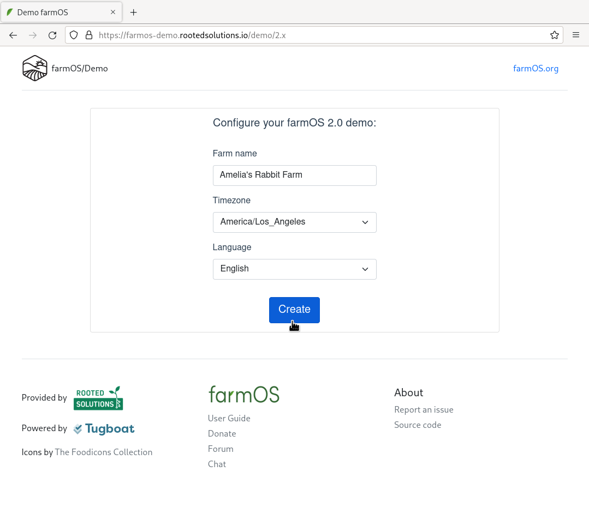

This could take a few minutes so please be patient.

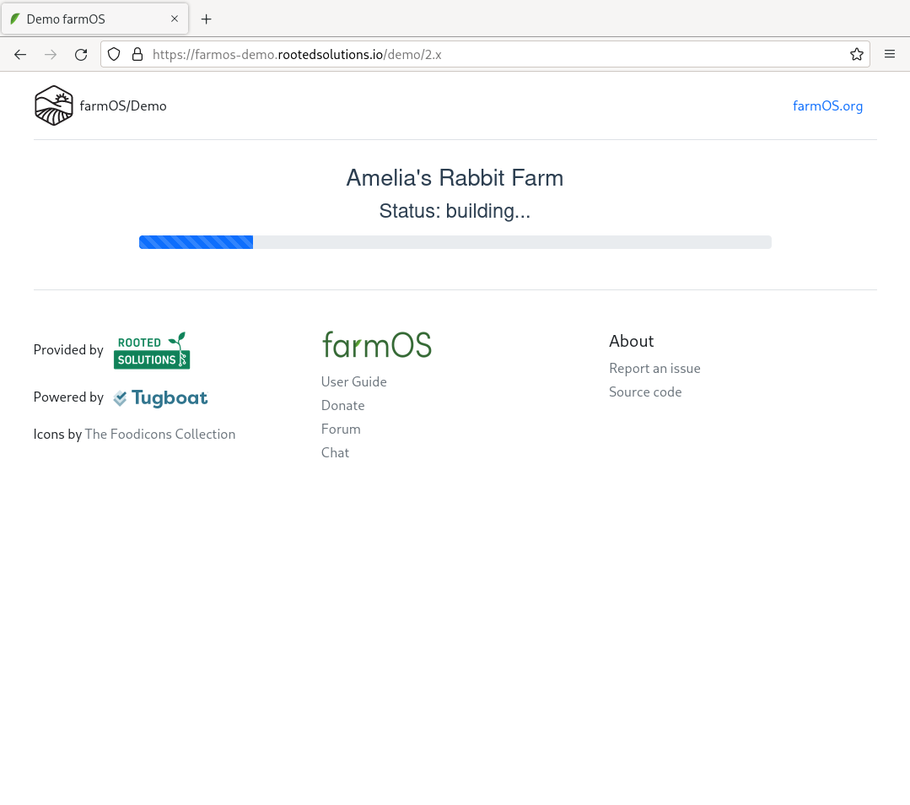

If you get an error, start over after a little while. It is worth noting that the demo instances are insecure and fragile in some ways that are not representative of farmOS in general. Do not create data that is secret or that you would mind needing to recreate.

***Note:** Data created in the demo instance is ephemeral (short-lived). The whole instance and all data it contains will become innaccessible then get **permanently deleted** after about 12 hours. Because of this, it is critical that you only use the instance for experiments or data that are okay to lose.*

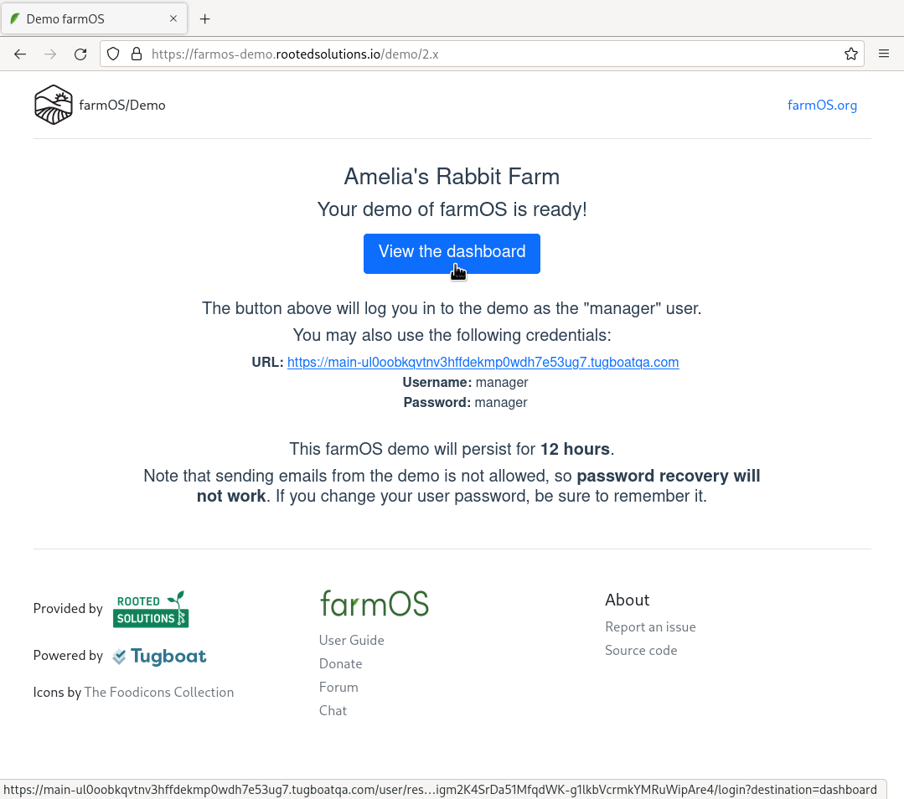

Save the URL, username, and password from that page (from your screen, not the screenshot above) to a file on your computer or email them to yourself. If you need to return to the farmOS instance within the next 12 hours you will need that information.

Next click the "View the dashboard" link to open farmOS.

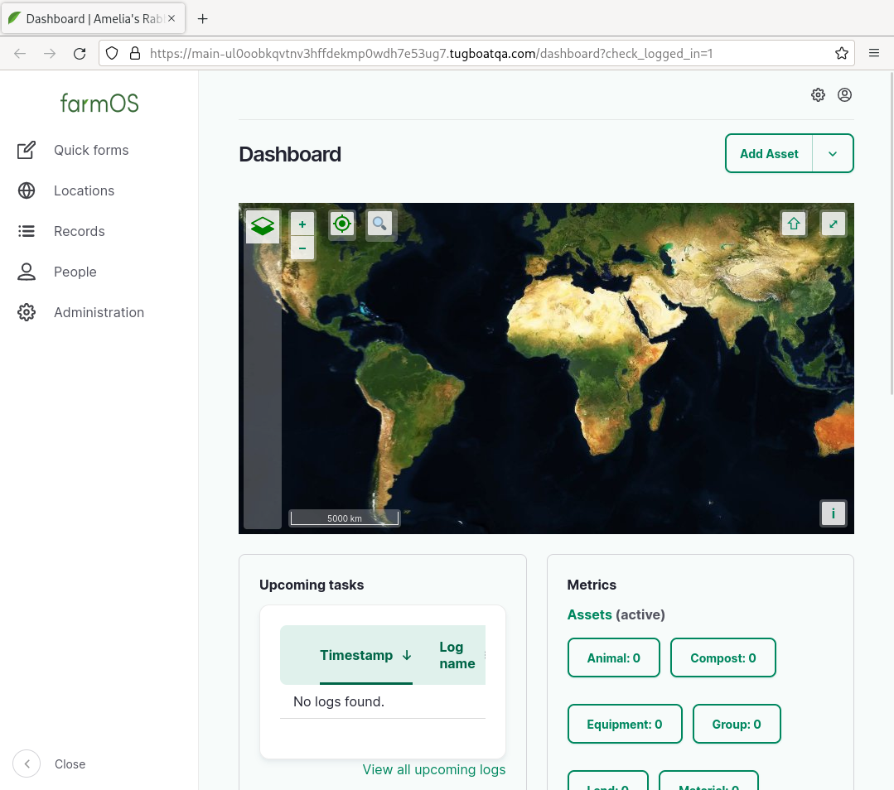

## Mapping Your Growing Space

In farmOS "assets" are a type of record which represent one or more of your growing things or their context so that you can store information about them. Examples of assets might be:

* Individual chickens or a flock of chickens
* Trees or a whole orchard
* Garden beds or fields
* Property boundaries, sheds, coops, barns, greenhouses, etc

Our first record will be a property boundary. This is helpful because it provides general context and makes it easier to locate other assets within your growing space in the future.

Click "Add Asset" in the top right corner:

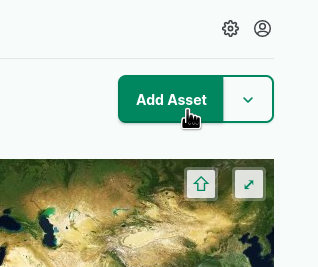

Then choose the "Land" asset type:

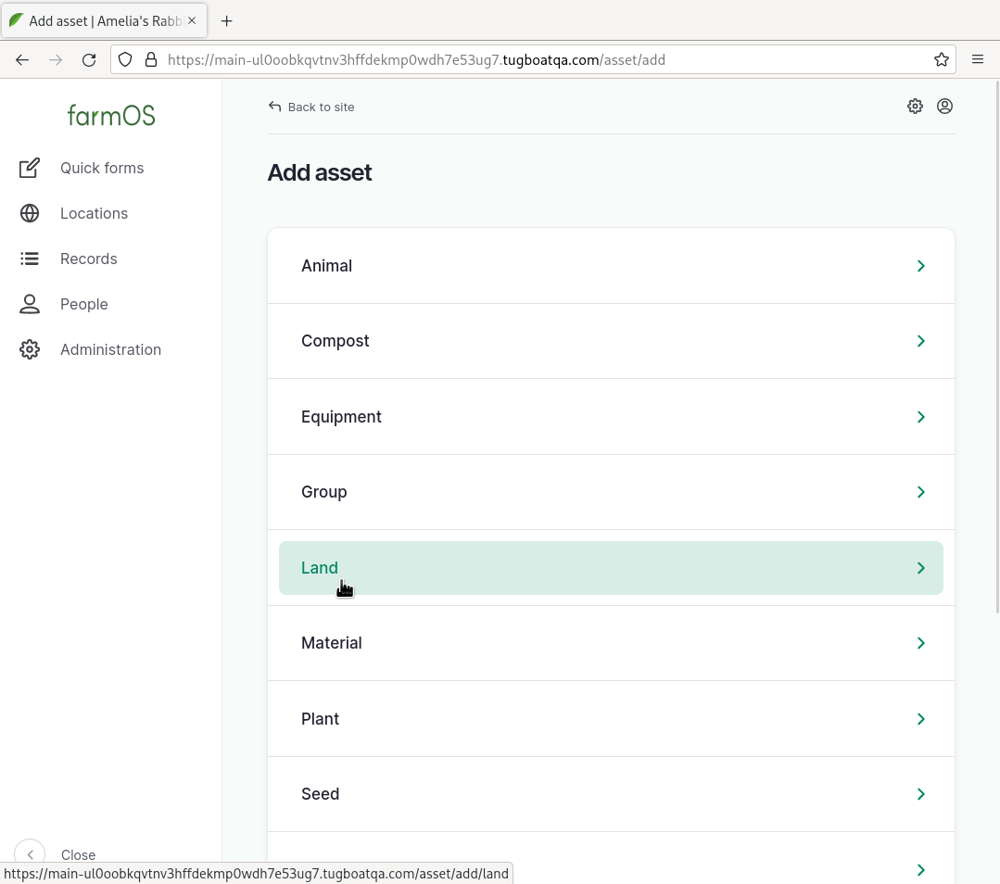

In the "Add Land" asset creation form, we will put in just three things:

* **Name:** "Property Boundary"
* **Land type:** "Property"
* **Intrinsic geometry:** see below

For the "Intrinsic geometry" zoom in using the "+" button and move around the map by clicking/touching and dragging until you have located your growing space. Alternatively, you may be able to use the magnifying glass button to search for your address.

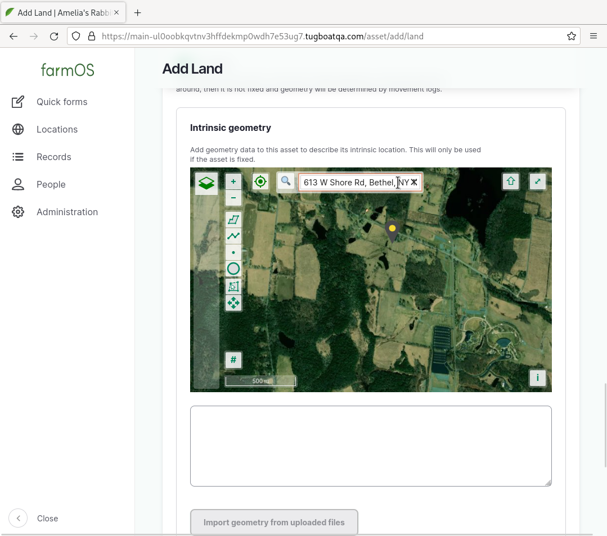

Click the top-most of the 6 buttons that are along the left-middle of the screen (just below the "+"/"-" buttons).

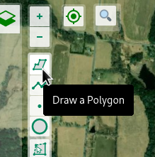

Then draw the outline of your growing space by click on each point around the border and then finally back on the first point until it forms a completed polygon.

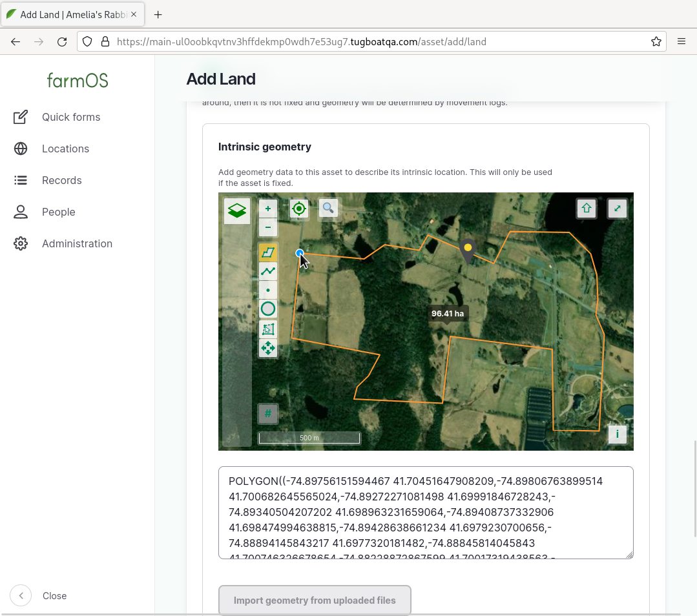

Once you have something on the map, scroll to the bottom of the form and click "Save". Do not worry about getting the geometry perfect, you can always edit the property boundary asset to refine it later.

Congratulations, you've just created your first farmOS asset! Now, if you click the "farmOS" text in the top left to return to the farmOS dashboard, you will see the map zoom in to your property boundary.

## Adding a Growing Thing

Next we're going to add a growing thing, for this example it will be a sheep named "Dolly". From the farmOS dashboard, click "Add Asset" again and this time select the "Animal" asset type.

Then fill in the following information and click "Save" at the bottom:

* **Name:** "Dolly"
* **Species/breed:** "Sheep: Finnish Dorset"
* **Birthdate:** July 5th 1996
* **Sex:** "Female"

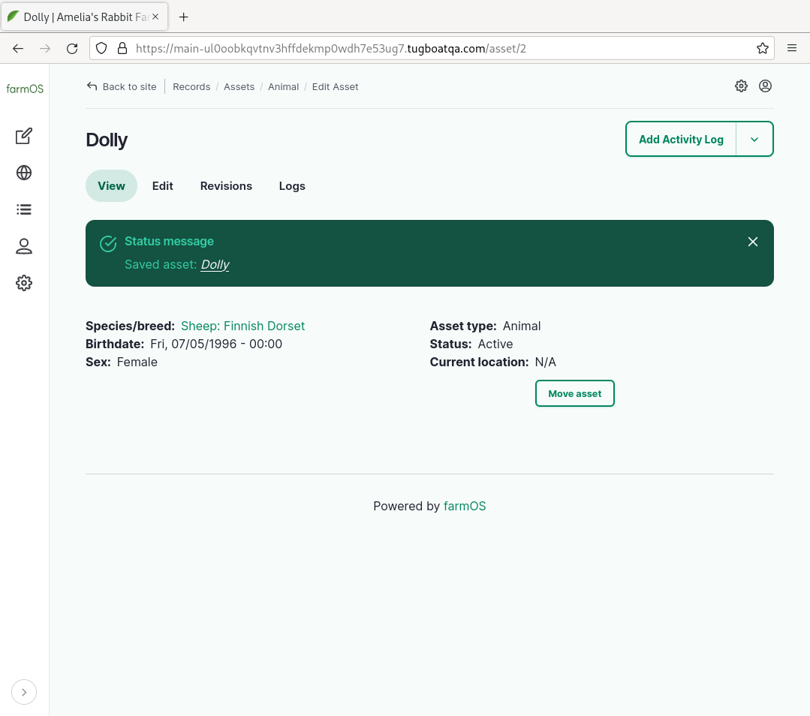

## Creating a Log About Dolly

Now that you have seen how assets and the basic information about them is input, we come to the other main way data is stored in farmOS, logs. Logs describe information or events that are associated with a specific point in time. Often logs reference one or more assets as well.

For this example, we're going to create a log about Dolly - our new sheep asset - to record when her wool was shorn. This could be useful because you might want to look back and see which of your sheep in a large flock already got shorn in a given spring or in future years to see what date in the spring you typically shear sheep.

On the top, right click the button that says "Add Activity Log", then enter the relevant information. For now we will just give the log a name, change the status to "Done" and leave everything else with the default values.

* **Name:** "Shear Dolly"
* **Status:** "Done"

Then click "Save" at the bottom.

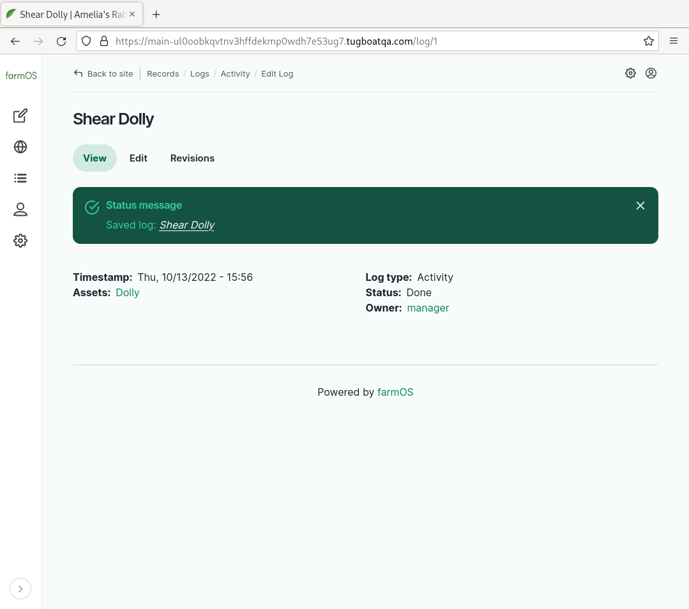

Congratulations, you have now created your first log in farmOS! It describes when the shearing occurred, who did it, and what sheep was shorn.

## Summary

Thanks for following along! Hopefully, this post has given you a small taste of the way farmOS models data and whetted your appetite to learn more.

One of the best things about farmOS is its active friendly community. In addition to the official documentation - especially the [user guide](https://farmos.org/guide/) and [data model](https://farmos.org/model/) docs - check out the community resources such as the [forum](https://farmos.discourse.group/) and [chat](https://riot.im/app/#/room/#farmOS:matrix.org). Please feel free to drop in, introduce yourself, and ask any questions that occur to you! Often farmOS is improved for everyone on the basis of the questions newcomers bring to light.
