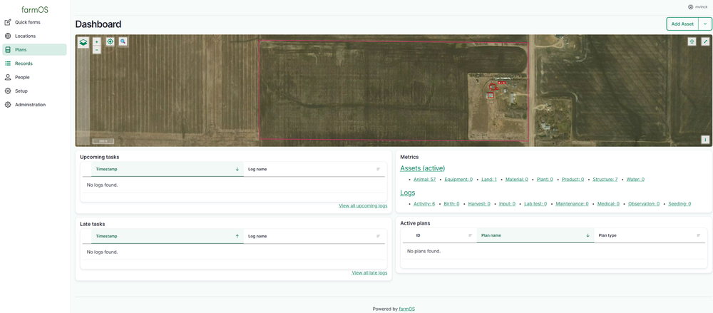
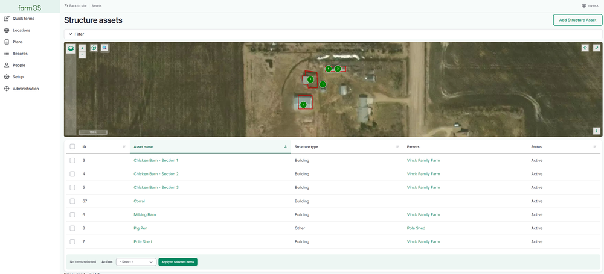
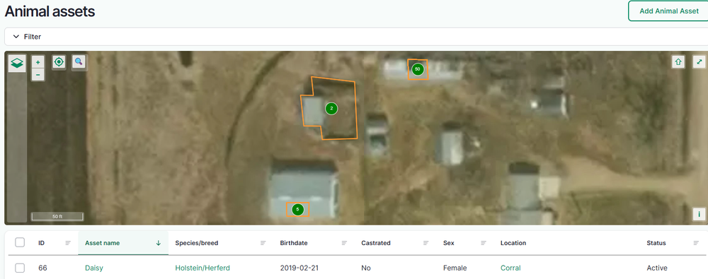
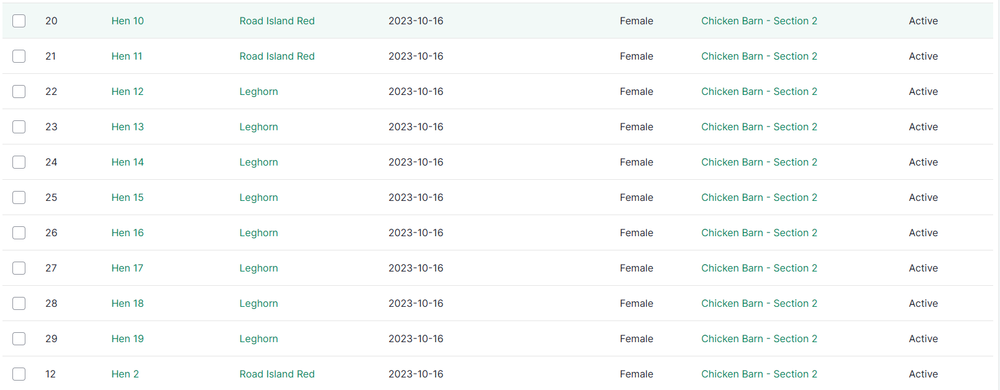
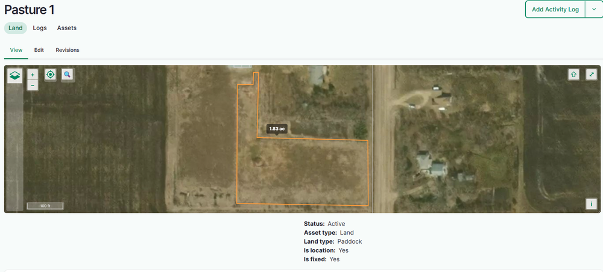
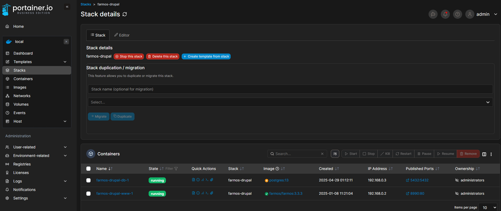
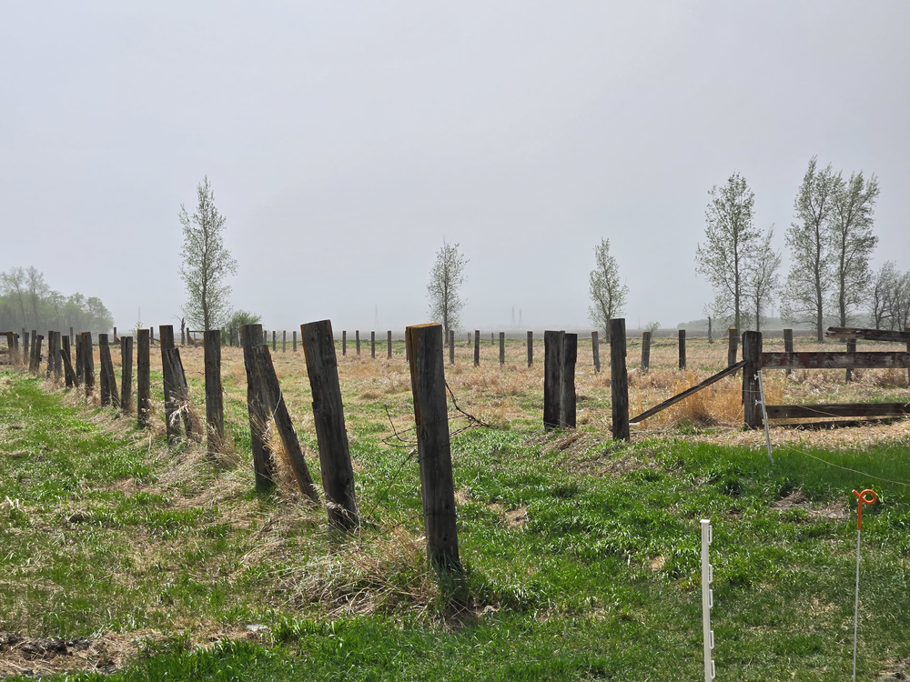
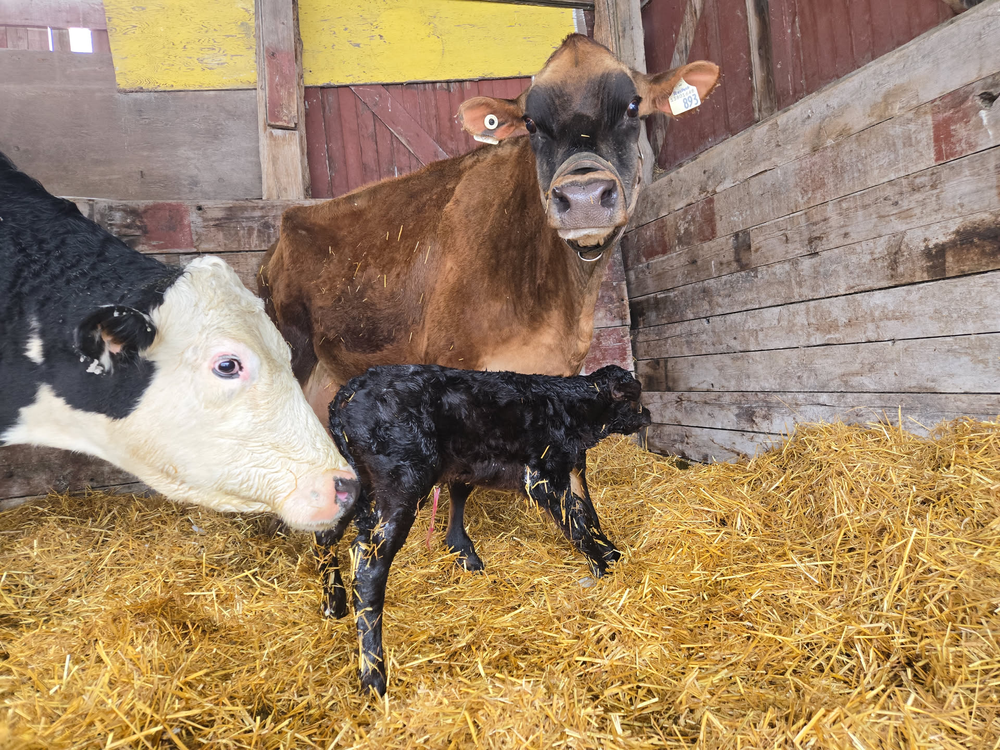

# farmOS and Coffee: Tracking Animals, Data, and Sanity

*This blog post is copied with permission from
[brewingbytesandbeans.com](https://brewingbytesandbeans.com/farmos-and-coffee-tracking-animals-data-and-sanity/).*

Some people start their day scrolling through social media, sipping their
coffee while halfheartedly liking posts. Not me. I prefer to pair my morning
brew with something far more fulfilling: FarmOS. Installed on Docker and
managed through Portainer stacks, this open-source marvel has become my
farming companion, turning chaotic livestock tracking into a well-oiled
machine. It's not just software; it's a lifesaver—one that pairs perfectly
with a steaming cup of dark roast.

## Starting Small but Dreaming Big

When I first set up farmOS, it was all about simplicity. Track the property and
buildings, get a feel for the layout, and see how the software works. I
meticulously mapped out our land—from the chicken barn to the garden—and even
included the in-laws' farm, where some of our animals roam. It was like
building a digital twin of the farm, and let me tell you, there's something
oddly satisfying about seeing your world laid out so neatly on a screen.

Then came the animals. First, the poultry: 11 Rhode Island Red hens, 2 Jersey
Giant roosters, and 38 Legbar hens. Each bird earned its place in the system,
complete with notes on feeding schedules, egg production trends, and health
updates. farmOS turned out to be a fantastic way to streamline their
management. No more hunting for scraps of paper or trying to remember if a
certain hen had been molting last week—I had it all in one place.

## Preparing for the New Arrivals

With the groundwork laid, it was time to think bigger. We're getting pigs this
weekend and cows in the new year, so I've been expanding the farmOS setup to
accommodate them. Each animal will have a detailed profile, tracking everything
from health data to grazing schedules. The software lets me prep in
advance—setting up templates, organizing feed plans, and even planning
rotations for the cows once they arrive.

Adding new animals is exciting, but it's also a reminder of why systems like
farmOS are so valuable. Farming is full of moving parts, and the more you can
track and organize, the smoother things run. It's not just about efficiency;
it's about making sure every animal gets the care it needs.

## The Tech Side of Farming

Running farmOS on Docker was a no-brainer. The setup is lightweight, efficient,
and leaves plenty of room for other projects. With Portainer stacks, managing
the installation is a breeze—it's almost too easy. Even after a long day of
farm work, I can spend a few minutes tweaking settings or adding data without
feeling overwhelmed.

Self-hosting is one of my favorite parts of this system. There's something
empowering about knowing all your data is in your hands, running on hardware
you control. No subscriptions, no reliance on external servers—just me, my
trusty server, and the farm.

## Morning Rituals and Real-Time Insights

Every morning, coffee in hand, I check the farmOS dashboard. Feed levels?
Check. Animal health notes? Updated. Egg production? Still going strong.
Sometimes I'll add a new fence line to the property map or update the layout
of the chicken run. It's become part of my daily routine, connecting me to the
farm in a way that's both practical and satisfying.

What really sets this system apart is the real-time insights it provides. If a
hen isn't laying as expected or a sensor picks up something unusual in the
coop, I know immediately. It's like having a second pair of eyes on the farm
at all times, letting me respond quickly and keep things running smoothly.

## Blending Tradition with Innovation

Farming has always been a balance of grit and ingenuity, and farmOS fits right
into that tradition. It's not just about keeping track of animals and
fields—it's about creating a system that supports the farm and everyone (and
everything) on it.

The chickens are thriving, the pigs will have everything they need from day
one, and the cows—when they arrive—will slot into this setup seamlessly. With
farmOS keeping the farm in check and coffee keeping me in check, it feels like
the perfect partnership.

Now, if only farmOS had a feature to remind me when my coffee cup is empty.
Data might fuel the farm, but coffee fuels me.
