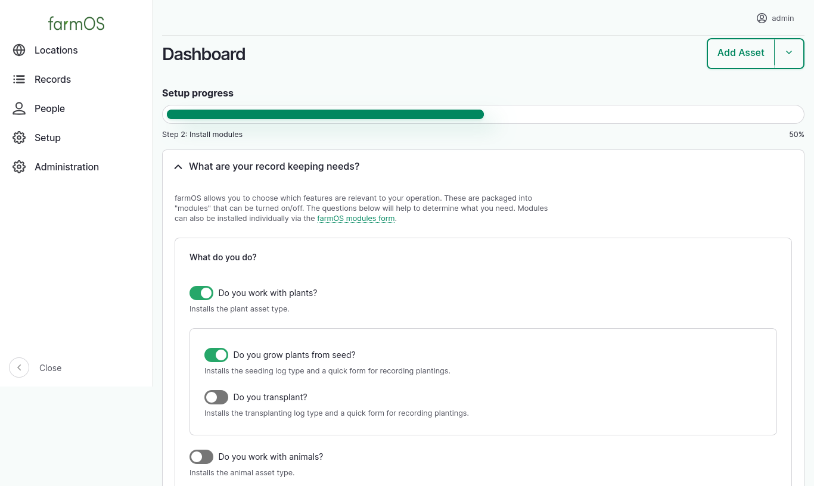

# farmOS v4 (and v3.5)

We are excited to announce the first release of
[farmOS v4](https://github.com/farmOS/farmOS/releases/tag/4.0.0), as well as
[farmOS v3.5.1](https://github.com/farmOS/farmOS/releases/tag/3.5.1) (the last v3 release)!

**Please note: you must update to 3.5.1 before updating to 4.0.0.**

farmOS v4 includes a number of new features and improvements, as well as some
breaking changes that module developers and hosts should be aware of. Below is
a summary of the highlights. For a complete list of change, please refer to the
[v4 Changelog](https://github.com/farmOS/farmOS/blob/4.0.0/CHANGELOG.md).

## New features

### farmOS Setup Wizard



farmOS v4 introduces a "Setup Wizard" on the dashboard to welcome and guide
users through the next steps with a new farmOS instance.

The setup steps include a new question-driven form for enabling farmOS modules
based on the type of growing and/or farm operation the user has. Helping users
choose just the modules relevant to their farm compliments the changes
(described below - see "[Default module changes](#default-module-changes)") to
make farmOS installations lighter-weight and less overwhelming by default.

Also included is a "Resources" step to connect users with further documentation,
support, and invite them to participate in the wider farmOS community.

The setup wizard was designed to allow more steps to be added in the future,
and modules can provide their own steps as well. So this is only the first step
towards improving the initial experience. Potential future steps may include:

- Initial farm mapping
- Initial asset and taxonomy imports
- Language configuration

More details:
[Add a farmOS setup wizard #1035](https://github.com/farmOS/farmOS/pull/1035)

### Farm Organizations

A new "Farm Organization" record type has been introduced, which is a first
step towards modeling records across multiple farms in a single farmOS
instance. This is provided by a new optional module, and may be helpful for
organizations that want to use farmOS to manage data collected from multiple
farms. It can also be helpful if you manage assets across disparate locations,
and want a way to separate and organize your records.

When the module is installed, a new "Farm" reference field is added to assets,
so they can be assigned to a Farm Organization. Logs are not directly assigned
to farms, but their association can be inferred based on the asset(s) they
reference. It is possible to filter assets by farm, and view maps of locations
by farm.

Notably, this feature only allows the data model to represent Farm Organizations
and asset relationships to them. It does _not_ provide any access control
between Farm Organizations. There are no permissions available to grant access
to one farm's records while restricting access to others. So while this may be
useful for some, it is not a "multi-tenant" solution, and if access separation
is required between farms then it is still recommended that each farm be set up
in its own farmOS instance, which already provides complete access separation.

The "multi-tenant" access control features are being explored in this community
add-on module, which leverages the Drupal
[Group](https://www.drupal.org/project/group) module to manage access to
individual farm records:
[farmOS Multitenant](https://www.drupal.org/project/farm_multitenant)

More details:
[Add an Organization entity type with a Farm bundle #849](https://github.com/farmOS/farmOS/pull/849)

### Google Maps

[Google Maps](https://www.google.com/maps) base layers are now available in
farmOS core. They can be turned on via a new `farm_map_google` module, similar
to the existing [Mapbox](https://www.mapbox.com/) layers module
(`farm_map_mapbox`). Both of these are third-party tile providers that require
an API key to use their layers.

This is possible thanks to the new
[Map Tiles API](https://developers.google.com/maps/documentation/tile/overview),
which allows open source mapping libraries like
[OpenLayers](https://openlayers.org/) (which farmOS's maps are built on) to use
Google's map layers directly. Previously, doing so was a violation of Google's
terms, and Google map tiles could only be used in its
[Maps Javascript API](https://developers.google.com/maps/documentation/javascript/overview).

A hacky workaround was used in the past to include these in farmOS, available
in the [farmOS Google Maps](https://www.drupal.org/project/farm_map_google)
community add-on module. This is no longer necessary, and that module has been
deprecated.

More details:
[Add Google Maps base layers #946](https://github.com/farmOS/farmOS/pull/946)

### Abandoned Logs

In addition to the existing "Pending" and "Done" log status options, a new
"Abandoned" status is now available. This is useful to represent that a log
is never going to be completed, but there is still value in preserving it for
historical reference.

More details:
[Add abandoned log status #945](https://www.drupal.org/project/farm/issues/3304608)

### Term Merge

The [Term Merge](https://www.drupal.org/project/term_merge) module has been
added. This adds the ability to "merge" two or more taxonomy terms, and update
all the records that reference them automatically. If you have duplicate or
similar terms in your taxonomies, this provides a useful option for cleaning
them up.

More details:
[Add Term Merge module #961](https://github.com/farmOS/farmOS/pull/961)

## Breaking changes

### PHP and database version requirements

farmOS v4 requires PHP 8.4, and has the following minimum database version
requirements (inherited from
[Drupal 11](https://www.drupal.org/docs/getting-started/system-requirements/database-server-requirements)):

- PostgreSQL 16+
- MariaDB 10.6+
- MySQL/Percona 8.0+
- SQLite 3.45+

The following PHP extensions are now required:

- [BCMath](https://www.php.net/manual/en/book.bc.php)
- [EXIF](https://www.php.net/manual/en/book.exif.php)
- [GEOS](https://git.osgeo.org/gitea/geos/php-geos)

See [farmOS Server Requirements](https://farmos.org/hosting/requirements/) for
more information.

### Asset status is removed

Assets no longer have a "Status" (`status`) attribute. Instead, the "Archived"
(`archived`) attribute can be used to show/hide assets in UI lists and filter
records in API requests.

The benefit of this change is that it separates the concept of "archived" from
the concept of an asset's "status". In practice, "archiving" an asset is simply
a mechanism for hiding and filtering assets, so this makes that a simple
boolean checkbox. At the same time, it opens up the possibility for modules to
provide context-specific workflows by adding their own "status" field(s) on
assets. farmOS core no longer has an opinion about what "status" means in the
context of assets. It only knows if they are "archived" or not.

Databases that are upgraded from farmOS v3 to v4 will be migrated to the new
model automatically. If assets had a status of "Archived", they will have their
`archived` attribute automatically set to `true`. If they had a status of
"Active", then `archived` will default to `false`. If you have API integrations
that filter on the old `status` attribute, they should be updated to use the
new `archived` attribute instead.

A note about the `archived` attribute: assets in farmOS v3 had a hidden
`archived` attribute that recorded a timestamp when the asset was "last
archived". This has been renamed to `last_archived` (also hidden) to make room
for the new `archived` boolean field. The "last archived" timestamp is
preserved in v4, but it will be phased out entirely in farmOS v5. Instead, the
recommendation is to use a log to record when an asset is terminated or
disposed of. The
[Asset Termination](https://www.drupal.org/project/farm_asset_termination)
module provides a suggested data model and workflow for doing this.

More details:
- [Remove asset status + refactor how assets and plans are archived# 986](https://github.com/farmOS/farmOS/pull/986)
- [Proposal: Remove "Status" field from Assets and Plans](https://farmos.discourse.group/t/proposal-remove-status-field-from-assets-and-plans/2319)

### Plan status changes

A new "Archived" (`archived`) attribute has been added to plans, similar to
assets (described above). Plans still have a "Status" (`status`) attribute,
but the "Archived" status option has been removed.

Databases that are upgraded from farmOS v3 to v4 will be migrated to the new
model automatically. If plans had a status of "Archived", they will have their
`archived` attribute automatically set to `true`. If they had a status of
"Active", then `archived` will default to `false`. If you have API integrations
that filter out "Archived" plans using the `status` attribute, they should be
updated to use the new `archived` attribute instead.

In addition to the "Active" status, three new status options have been added to
plans: "Planning", "Done", and "Abandoned". This expands the range of
possibilities for representing plans. For example, it's possible specify that
"archived" plans are "Done" or "Abandoned" now, which was impossible to
represent before.

Note that plans with a status of "Archived" will be reset to a status of
"Active" during the upgrade. This is because we don't know _why_ the plan was
archived. It may have been completed, in which case it should have a status of
"Done". Or perhaps it wasn't completed and should have a status of "Abandoned".
So it is left up to data owners to decide if they want to go back and update
the status of their "archived" plans to set a more accurate status.

More details:
- [Remove asset status + refactor how assets and plans are archived# 986](https://github.com/farmOS/farmOS/pull/986)
- [Proposal: Remove "Status" field from Assets and Plans](https://farmos.discourse.group/t/proposal-remove-status-field-from-assets-and-plans/2319)

### Animal is_castrated is now is_sterile

The Animal asset `is_castrated` attribute has been renamed to `is_sterile` to
make it more generally useful for describing any animal that is incapable of
reproducing.

More details:
[Change Animal asset is_castrated attribute to is_sterile #960](https://github.com/farmOS/farmOS/pull/960)

### Roles and permissions

There are a few changes to default roles and permission to be aware of.

The "Worker" role no longer has the ability to delete records that were created
by other users, or the ability to update or delete taxonomy terms. These
actions must be performed by a higher role (like "Manager"). More details:
[Limit permissions of worker role #1033](https://github.com/farmOS/farmOS/pull/1033)

New entity "collection" permissions have been added, and are required for
accessing collections of records. This includes all the default list UIs for
assets, logs, organizations, plans, and quantities provided by farmOS.
Previously, these lists required permissions that should be reserved for
higher-level roles. For example, a user previously needed the "view all assets"
permission to access "Records > Assets" from the main menu. Now, they need
"access asset collection" and at least one other asset view permission, but
these can be more limited (eg: "view own animal assets"). This makes it easier
to build roles with more limited access, while still allowing them to access
the default record list UIs in farmOS, which will intelligently filter out
records that the user should not see. More details:
[Allow more granular access to views #965](https://github.com/farmOS/farmOS/pull/965)

A new "Config Admin" role has been added to compliment the existing
"Account Admin" and "Manager" roles. This role is useful if you want to
grant access to change farmOS configuration to certain users. Previously, the
"Account Admin" and "Manager" roles were used to grant this access. Now, the
"Account Admin" role is _only_ intended for managing user accounts, and the
"Manager" role is primarily for managing records. More details:
[Add a Config Admin role for granting access to farmOS configuration #1022](https://github.com/farmOS/farmOS/pull/1022)

The "Manager", "Worker", and "Viewer" roles have been moved to separate
modules so they can be turned on/off individually. Previously, these were all
provided by the "Default roles" module. More details:
[https://www.drupal.org/node/3527787](https://www.drupal.org/node/3527787)

The "Account Admin" role has moved from the `farm_role_account_admin` module to
a new `farm_account_admin` for consistency. More details:
[https://www.drupal.org/node/3527786](https://www.drupal.org/node/3527786)

### Quick form changes

The `QuickFormBase` base class `__construct()` method signature has changed. If
you maintain a quick form in your module that extends from `QuickFormBase`, it
may need to be updated.

Previously, only the `messenger` service was injected into the base class. Now,
the `entity_type.manager` and `current_user` services are also injected,
because they are commonly needed in quick forms.

Also, farmOS has adopted service autowiring and PHP 8 constructor property
promotion, which greatly reduces the amount of boiler-plate code necessary to
build quick forms that require additional services.

More details:

- [Inject entity_type.manager and current_user service dependencies into QuickFormBase class #989](https://github.com/farmOS/farmOS/pull/989)
- [Autowire injected service dependencies #1006](https://github.com/farmOS/farmOS/pull/1006)
- [Use PHP 8 constructor property promotion #1005](https://github.com/farmOS/farmOS/pull/1005)

### Default module changes

It is no longer possible to install "default" and "optional" modules during
initial farmOS installation. Instead, modules must be installed after initial
installation. This can be done via the command line, or via the UI (for
example, with the new [farmOS Setup Wizard](#farmos-setup-wizard) described
above).

Previously, it was possible to specify "sets" of modules to install from the
command line during the `drush site-install` command (eg: `base`, `default`,
and `all`). These options have been removed.

If you need to install modules during a CI/CD operation, use `drush en` to
install them individually.

if you need to install _all_ modules, a new Drush command is provided by the
`farm_test` module for doing so. To use it, first install `farm_test`, then
run the `farm_test:modules` command. For example:

```
drush site-install -y --db-url=pgsql://farm:farm@db/farm --account-pass=admin
drush en farm_test
drush farm_test:modules
```

Other notable changes:

- The farmOS API module (`farm_api`) is no longer installed by default. More
  details:
  [Make the farmOS API optional #974](https://github.com/farmOS/farmOS/pull/974)
- The OAuth2 logic has been separated out of the API module to its own farmOS
  API OAuth2 Server module (`farm_api_oauth`), for cases where the API is
  necessary, but an OAuth2 server is not. More details:
  [Make farmOS API OAuth2 Server optional #973](https://github.com/farmOS/farmOS/pull/973)
- OAuth2 public/private keys are not automatically generated during
  installation. See [OAuth2 keys](/hosting/install/#oauth2-keys) for manual
  setup steps. More details:
  [Do not generate keys during farm_api_install() #972](https://github.com/farmOS/farmOS/pull/972)

### Docker runs as www-data

The farmOS Docker images now run as `www-data` by default, for added security.

More details:
[Run Docker container as www-data user #1009](https://github.com/farmOS/farmOS/pull/1009)

### Configuration will not be reverted automatically

farmOS includes a module called "farmOS Update" (`farm_update`) that makes it
easier for module maintainers to update configuration entities in their modules
without writing update hooks. It essentially compares the config entities
defined in the module's `config/install/*.yml` (and `config/optional/*.yml`) to
the config entities installed in the database, and reverts them if there are
any differences. This is helpful in simple installations, but can cause issues
in environments with
[managed configuration](https://www.drupal.org/docs/administering-a-drupal-site/configuration-management/managing-your-sites-configuration).
The recommendation was to uninstall `farm_update` in those contexts.

Now, modules can opt-in to automatically reverting their config entities. If
they do not, then they will need to provide update hooks when they make
changes to config entities.

More details:
[Change farmOS Update config revert logic from opt-out to opt-in #1011](https://github.com/farmOS/farmOS/pull/1011)

### Packaged releases are no longer recommended

Please note that pre-built "packaged" releases of farmOS are no longer one of
the recommended methods for hosting farmOS. They will still be generated with
each release, but system administrators are encouraged to move to a deployment
workflow that uses Docker and/or Composer. See the updated farmOS installation
docs for more information:

- [Installing farmOS](https://farmos.org/hosting/install/)
- [farmOS in Docker](https://farmos.org/hosting/docker/)
- [Building farmOS with Composer](https://farmos.org/hosting/composer/)

## Community module updates

In the lead up to this release, the farmOS community has been hard at work
making sure that farmOS community add-on modules are updated and ready for
farmOS v4. At the time of writing, the following modules either have a
v4-compatible release or have a merge request open to provide one:

- [Asset Link](https://www.drupal.org/project/farmos_asset_link)
- [Asset Termination](https://www.drupal.org/project/farm_asset_termination)
- [Beekeeping](https://www.drupal.org/project/farm_bee)
- [Biodynamic](https://www.drupal.org/project/farm_biodynamic)
- [Calculation](https://www.drupal.org/project/farm_calculation)
- [Calendar](https://www.drupal.org/project/farm_calendar)
- [Convention](https://github.com/mstenta/farm_convention)
- [Crop Plan](https://www.drupal.org/project/farm_crop_plan)
- [Document](https://github.com/mstenta/farm_document)
- [Eggs](https://www.drupal.org/project/farm_eggs)
- [Forest](https://www.drupal.org/project/farm_forest)
- [Fungi](https://www.drupal.org/project/farm_fungi)
- [Grazing Plan](https://www.drupal.org/project/farm_grazing_plan)
- [Integration](https://www.drupal.org/project/farm_integration)
- [John Deere](https://www.drupal.org/project/farm_jd) &ast;([merge request](https://www.drupal.org/project/farm_jd/issues/3573621))
- [Ledger](https://www.drupal.org/project/farm_ledger)
- [Map Custom Layers](https://www.drupal.org/project/farm_map_custom_layers)
- [Maple](https://www.drupal.org/project/farm_maple)
- [Multitenant](https://www.drupal.org/project/farm_multitenant)
- [NRCS](https://www.drupal.org/project/farm_nrcs)
- [Organic](https://www.drupal.org/project/farm_organic)
- [Project Plan](https://www.drupal.org/project/farm_project_plan) &ast;([merge request](https://www.drupal.org/project/farm_project_plan/issues/3573622))
- [RCD Conservation Planner](https://www.drupal.org/project/farm_rcd)
- [Restricted Entry Interval](https://www.drupal.org/project/farm_rei) &ast;([merge request](https://www.drupal.org/project/farm_rei/issues/3573624))
- [Weather](https://www.drupal.org/project/farm_weather)
- [Web Feature Service](https://www.drupal.org/project/farmos_wfs)

## Thanks

We couldn't have done all of this without the generous support and contributions
of our community!


If you would like to help support the continued development of farmOS and its
community, please consider sponsoring our work:
[farmOS.org/donate](https://farmos.org/donate/)

Thank you and Happy Spring! 🎉
